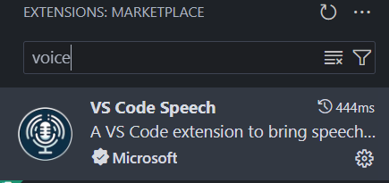
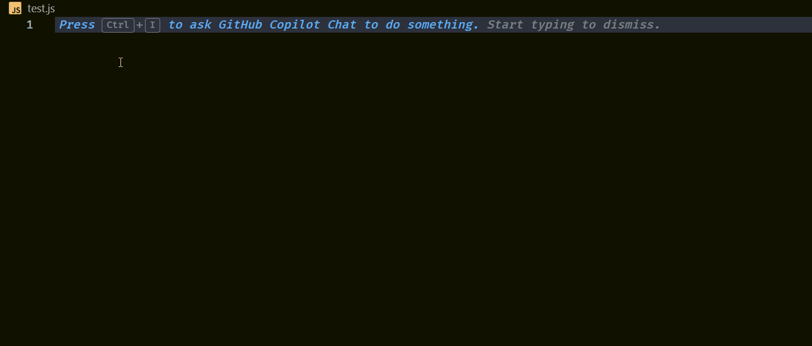

# how to use the voice dictation feature from VS Code with Git Copilot

About: 

With Version `1.87` the VS Code Team implemented a voice dictation feature which can be used with GitHub Copilot. This Tutorial aims to show how to use it and configure it.

What you need:

- VS Code on the latest version
- GitHub Copilot on the latest version
- [VS Code Speech Extension](https://marketplace.visualstudio.com/items?itemName=ms-vscode.vscode-speech)

## Install VS Code Speech

1. Go to Extensions and search for 'voice' - the first result should be the right extension
	
2.  click on install
	
3.  Some facts:
	 - The extension doesn't require a internet connection
	 - Process the audio data locally
	 - You can set up your desired language under settings > Accessibility > Voice: Speech Language - to find the option write 'voice' into the search bar
	
4. To use the voice dictation with Co Pilot simple summon the Copilot Chat by pressing `Ctrl + I`. To activate the voice dictation simply press `Ctrl + I` again. Copilot will receive your prompt and do what you want from him. After that simply press `Ctrl + Enter` or if you don't like it press on the `Discard` button.
  - Example:
	  - 
 
